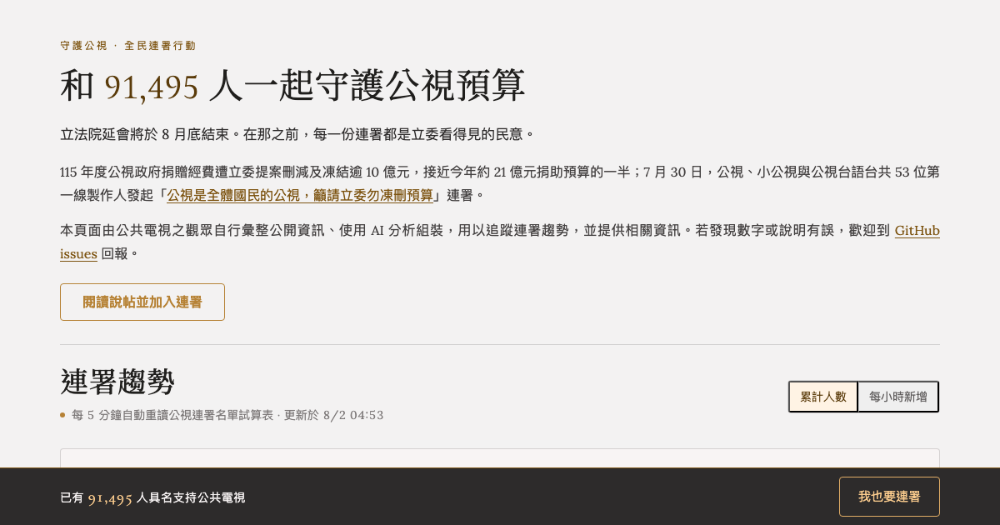

# 守護公視全民連署趨勢看板

追蹤「守護公視全民連署」的連署趨勢,並整理立法院 115 年度公視預算刪凍提案的相關資訊。以純靜態網頁部署在 GitHub Pages:https://mrorz.github.io/pts-budget-2026/



## 資料來源

- **連署趨勢**:[連署試算表](https://docs.google.com/spreadsheets/d/16TZCIWrIs0EKbAKJ35x7pHnOj-KQgViTa7w27kOA2Zw/edit)背後的 Google 表單已達 10 萬筆回應上限、停止同步,因此不再即時抓取。
- **預算表**:115 年度公視預算書已經定案,已彙整成[預算試算表](https://docs.google.com/spreadsheets/d/1JDoZ72lLq2rF-bsGJaSg5Hetr8eZp23y67yj2-2NTyA/edit) 並存為 `budget-data.json`,隨頁面一起發布。
  - 若 sheet 有誤，會在更新 spreadsheet 後重新更新 JSON。

## 授權

以 [CC0 1.0 Universal](./LICENSE) 釋出,等同放棄著作權、進入公眾領域,歡迎自由取用、修改、轉散布。

## 回報問題 / 貢獻

這個專案的文案、版面、互動設計是在 [Claude Design](https://claude.ai/design) 畫布上迭代,本機 repo 只維護圖表資料讀取的程式邏輯,兩者的協作管道不同:

- **文案、版面、內容有誤**(例如：捐贈金額寫錯、某段說明看不懂、想調整版面配色)→ 請開一個「內容/文案」issue,會在 Claude Design 端修改後同步回本機,**不接受直接修改文案的 PR**。
- **圖表/資料讀取邏輯有 bug,或想改善效能**(例如：`index.html` 裡讀取試算表的 JS)→ 歡迎直接開 PR。

## 本機開發

因為排版與文案的 source of truth 在 Claude Design,大部分協作不需要在本機把網站跑起來,只有異動到圖表/資料讀取邏輯時才需要:

```bash
npm run serve               # 起本機靜態伺服器預覽 index.html
npm run fetch-budget-data   # 從預算試算表重新產生 budget-data.json(僅預算書有勘誤時才需要)
npm run fetch-signup-data   # 從連署試算表重新產生 signup-data.json(表單已停止同步,理論上不會再需要)
```
